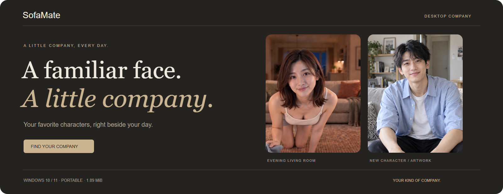
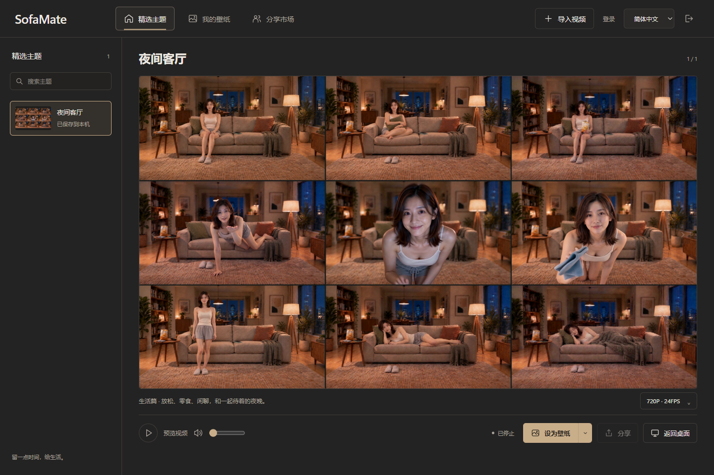
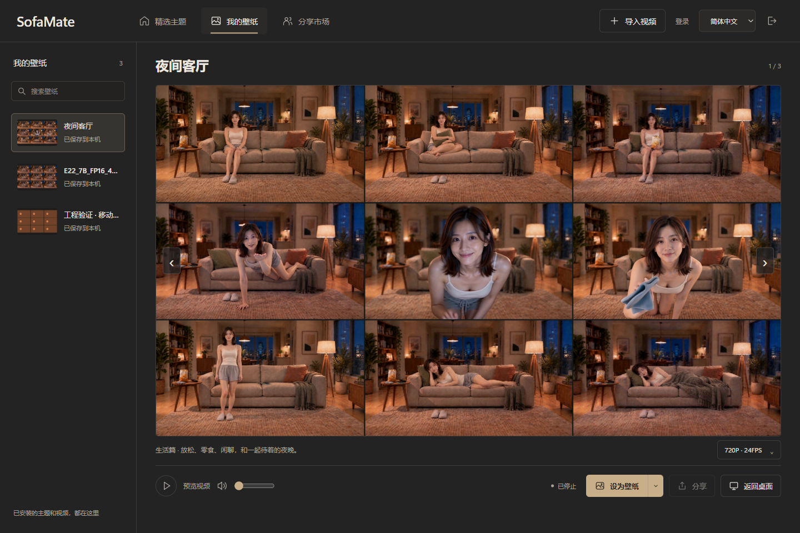
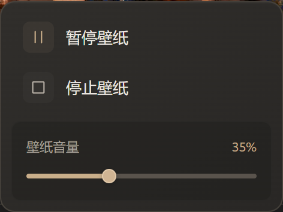
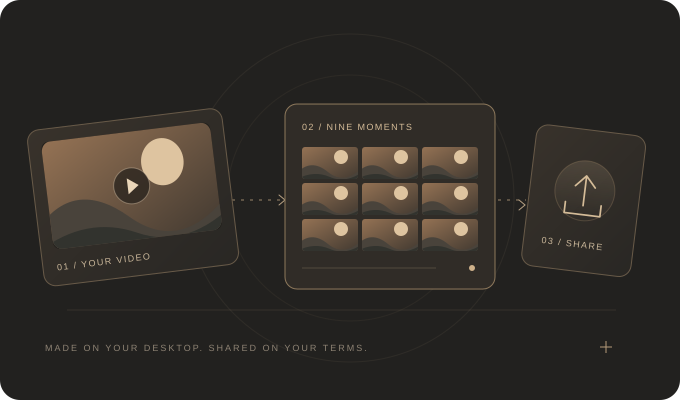

<p align="center"></p>

<p align="center"><b>A familiar face. A little company.</b><br>Keep your favorite characters on your Windows desktop, through work, study and time on your own.</p>

<p align="center"><a href="https://sofamate.aveniqa.com">Website</a> · <a href="https://github.com/UncleK/SofaMate/releases/latest">Download for Windows</a> · <a href="https://sofamate.aveniqa.com/market">Community</a> · <a href="README.zh-CN.md">简体中文</a> · <a href="README.ja.md">日本語</a></p>

<p align="center">  </p>

## Your kind of company



A familiar smile, a favorite character, a face you are happy to see. SofaMate turns character videos into desktop wallpapers, bringing a sense of company to work, study and time on your own. Choose the companion you like.

Download an official scene or import an MP4, browse its nine-frame preview and set it behind your desktop icons. Your collection stays local, ready whenever you want a little company.

| Your collection | Your controls | Your community |
| --- | --- | --- |
| Search local videos and installed themes. Browse with left and right arrows. | Preview inside the panel. Set, pause, resume, or stop the desktop separately. | Sign in to publish. Browse and download without an account. Keep downloaded videos offline. |

<table><tr><td width="70%"></td><td width="30%"></td></tr></table>

## Small by design

- **Tauri + system WebView2.** No bundled Chromium, Node.js, or FFmpeg in the desktop download.
- **Muted on startup.** Audio starts muted. Stopping destroys the desktop player; closing the panel keeps the wallpaper running.
- **Local first.** Import and playback work without an account. Previews are generated on your computer.
- **One Aveniqa account.** Email codes, GitHub, and Google use the shared account center in your system browser. Windows protects the desktop session with DPAPI.
- **Independent monitors.** Choose a wallpaper, quality and fit mode for each display. Default fill preserves proportions; fit keeps the whole image with borders.
- **Official scenes.** Evening living room has complete 720P24, 1080P24 and 1080P60 downloads. Its 28 clips follow defined random paths with smooth transitions. 4K is not offered for public download.
- **Three languages.** 简体中文 · English · 日本語.

<p align="center"></p>

## Get started

1. [Download the Windows ZIP](https://github.com/UncleK/SofaMate/releases/latest/download/SofaMate-Windows-x64.zip) and extract it.
2. Open `SofaMate.exe`. Download a featured or community work, or import your own H.264/AAC MP4.
3. Select a monitor and quality, then choose **Set as wallpaper**. Selecting a downloaded quality does not change the desktop until you apply it. Double-click the tray icon to return to the panel.

Windows 10/11 x64 and [Microsoft Edge WebView2 Runtime](https://developer.microsoft.com/microsoft-edge/webview2/) are required. The public beta supports independent multi-monitor wallpapers and imports up to 1 GiB per video. The Windows ZIP is about 1.95 MiB. The ZIP is unsigned. Videos are not bundled; official scene packs and community works are downloaded separately. New Aveniqa users can register through email verification or Google/GitHub in the shared account flow.

## Development

Node.js 24+, npm, Rust stable, Windows SDK and Visual Studio C++ Build Tools are required to build the desktop app. FFmpeg is only needed for authoring and test fixtures.

```powershell
npm ci
npm run build
npm run package:public
```

Output: `release/public/SofaMate/`. The public package starts with an empty theme catalog and contains no development paths or local accounts.

```powershell
npm ci --prefix experiments/tauri-client
npm run fixtures
npm run typecheck
npm run typecheck:client
npm test
npm run build:market
```

The market is a separate Node.js service. See [deployment and authentication](deploy/README.md), [pack format](docs/PACK_FORMAT.md), and [Windows wallpaper behavior](docs/WINDOWS_WALLPAPER.md). Shared playback logic lives in `src/core`; scene content is kept outside the player. The desktop entry point is `experiments/tauri-client` (the directory name is retained for compatibility).

## Project status

SofaMate is in public beta. Automatic video conversion, payments and automatic updates are not included. See [current release notes](docs/RELEASE_NOTES.md) for the available formats and validation limits. The repository does not contain production credentials, user uploads, or private authoring archives.

Questions and reproducible bugs are welcome in [Issues](https://github.com/UncleK/SofaMate/issues). Please keep private email addresses, tokens and local filesystem paths out of public reports. See [third-party notices](THIRD_PARTY_NOTICES.md). A license for SofaMate source and demo artwork has not yet been designated.

<p align="center"><sub>Your favorite characters. A little company, every day.</sub></p>
