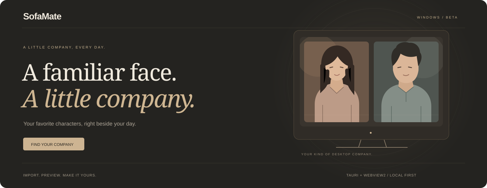

<p align="center"></p>

<p align="center"><b>让桌面，慢下来。</b><br>轻巧的 Windows 视频壁纸客户端。导入、预览、收藏，分享属于你的日常。</p>

<p align="center"><a href="https://sofamate.aveniqa.com">官网</a> · <a href="https://github.com/UncleK/SofaMate/releases/latest">下载</a> · <a href="https://sofamate.aveniqa.com/market">分享市场</a> · <a href="README.md">English</a></p>


## 刚刚好的陪伴

导入喜欢的 MP4，客户端自动生成九宫格预览。点击「设为壁纸」，画面便留在桌面图标后方。本机视频与已安装主题统一收在「我的壁纸」，支持搜索和左右切换。

| 本机使用 | 播放控制 | 分享社区 |
| --- | --- | --- |
| 无需账号，导入后离线播放 | 面板预览与桌面播放独立 | 注册登录后发布，所有人可浏览、下载 |
| 九宫格在本机生成 | 暂停、继续、停止、音量集中在小菜单 | 邮箱验证码、GitHub、Google 登录 |
| 简体中文、英文、日文 | 启动默认静音，停止释放桌面播放器 | 下载到本机后，可离线使用 |


## 开始使用

1. [下载 Windows ZIP](https://github.com/UncleK/SofaMate/releases/latest/download/SofaMate-Windows-x64.zip)，解压。
2. 双击 `SofaMate.exe`，点击「导入视频」。
3. 选择 H.264 / AAC 编码的 MP4，预览后点击「设为壁纸」。

关闭面板后，壁纸继续播放。双击托盘图标打开面板，右键显示控制菜单。停止后点击继续，会重新加载上一次壁纸。

当前为公开测试版，支持 Windows 10/11 x64、单主屏和最大 1 GiB 的视频，需要系统 WebView2 Runtime。客户端不捆绑 Chromium、Node.js 或 FFmpeg；安装包尚未代码签名。截图中的场景视频不随公开包分发，可导入自己的视频或从社区下载。默认壁纸库仍保留 `%LOCALAPPDATA%\ScreenMate\library` 路径，兼容早期版本。

## 开发与部署

构建需要 Node.js 24+、npm、Rust stable、Windows SDK 和 Visual Studio C++ Build Tools。FFmpeg 仅用于制作工具和生成测试素材。

```powershell
npm ci
npm run build
npm run package:public
```

运行验证前先执行 `npm ci --prefix experiments/tauri-client`，再运行 `npm run fixtures` → `npm run typecheck` → `npm run typecheck:client` → `npm test`。公开安装目录位于 `release/public/SofaMate/`。

市场与登录服务单独部署，不打进客户端。部署、账号及管理接口见 [服务说明](deploy/README.md)。代码许可证尚未指定，依赖及素材的权利分别保留，见 [第三方说明](THIRD_PARTY_NOTICES.md)。问题反馈请前往 [Issues](https://github.com/UncleK/SofaMate/issues)，不要公开邮箱、令牌或本机敏感路径。
